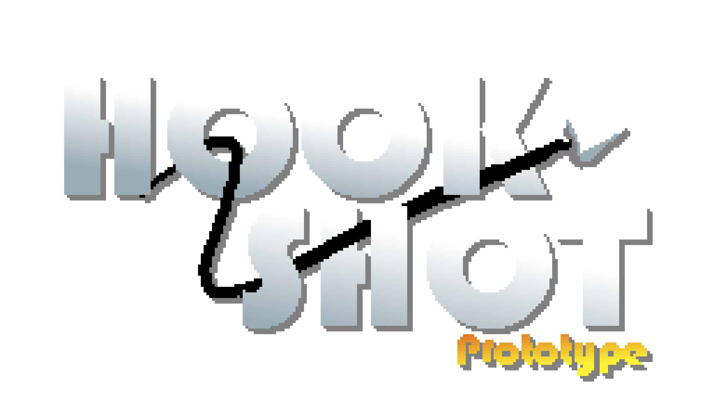

# Hook prototype

In this project, I will do all the tests for the mechanics of my game.  
The idea is to make a fast moving side scrolling platformer with a core mechanic, the *Hook*. I'm taking some inspirations:

- Ocarina of time: Hookshot
- Doom Eternal: Super shotgun
- Metroid Dread: Grappling beam (... I guess)

On the other hand, I like these fast moving *frenetic* games, such as:

- Sonic The Hedgehog
- Dead Cells
- DOOM

So I want to make the gameplay feel good,  intuitive, simple and *agile*.

Wish me luck!

## Technical info

- Editor version: `2021.3.0f1`
